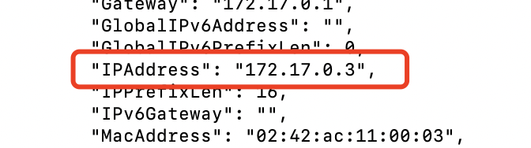

# 理论（一定要看，不看的话到时候出问题了怎么查都不知道）

## dobbo架构图（注意同步、异步）


## dubbo运行步骤

1、dubbo容器启动

2、服务提供者将服务注册到注册中心

3、服务消费者从注册中心找想要的服务（提供者的）

4、消费者直接调用提供者，地址是从注册中心拿到的

# 环境搭建

使用docker搭建的，虚拟机太不方便了

## 1、注册中心zookeeper

### 1、安装zookeeper

就用最新版的，不服来战

```dockerfile
docker run -d --name zookeeper -p 2181:2181 zookeeper
```

### 2、验证安装成功

去zookeeper里面的bin，有一个zkCli.sh文件，运行他

### 3、查看zookeeper的网址（用于后面管理系统管理）

docker inspect zookeeper的id

里面有个IPAddress，记住下来



## 2、安装dubbo管理工具

### 1、安装并运行dubbo-admin

```dockerfile
docker run -d \
--name dubbo-admin \
-p 9600:8080 \
-e admin.registry.address=zookeeper://zookeeper地址:2181 \
-e admin.config-center=zookeeper://zookeeper地址:2181 \
-e admin.metadata-report.address=zookeeper://zookeeper地址:2181 \
apache/dubbo-admin
```

启动可能会有点慢，因为是springboot项目

### 2、访问管理控制台

localhost:9600，账号密码都是root
